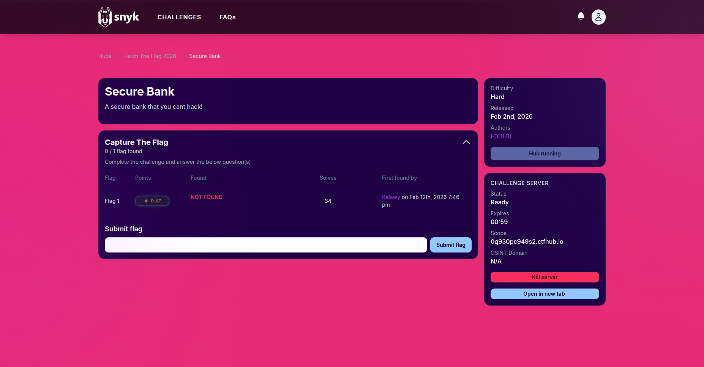

## Introduction

I had the honor of being a challenge author for **Fetch The Flag CTF 2026**, organized by **Snyk** and **HackingHub**. I designed a web challenge called **SecureBank**, which was solved **34 times** out of more than 1000 players by the end of the competition.

> **Want to try it yourself?** You can run the challenge locally before reading the writeup: [github.com/F0DH1L/snyk_ctf_2k26_chall](./challenge/)

## Writeup

The full writeup is available in the [solution](./solution) directory or on my blog:

[https://f0dh1l.github.io/blog/snyk_ctf_secure_bank/](https://f0dh1l.github.io/blog/snyk_ctf_secure_bank/)